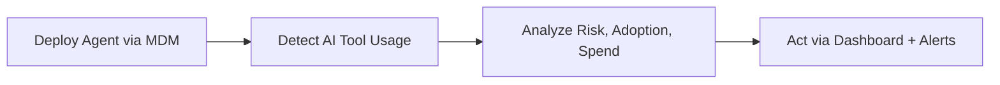
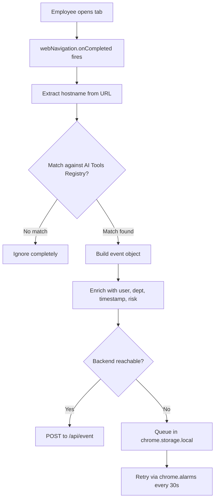
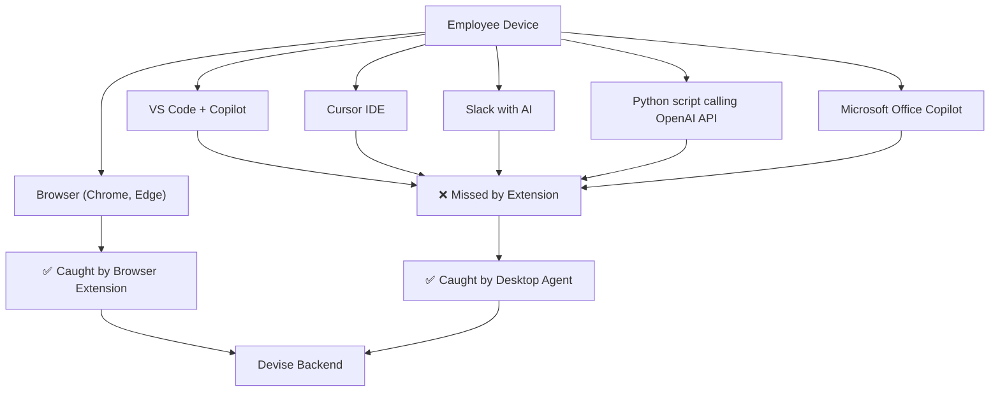
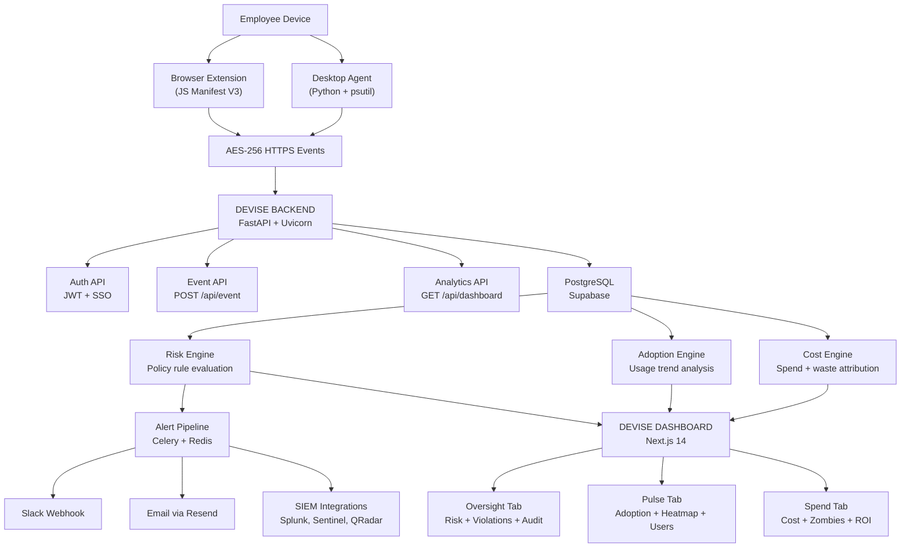

# Devise — The System of Record for Enterprise AI

> **See Every Tool. Govern Every Risk. Control Every Rupee.**

---

## The Core Idea

::: callout {icon="💡" color="blue_bg"}
**What is Devise?**
Devise is a B2B SaaS platform that gives companies complete visibility into every AI tool their employees are using — tracking adoption, spend, and risk from two lightweight agents: a browser extension and an OS-level desktop agent. No vendor integrations. No workflow disruption. Just real data, in real time.
:::

The problem is simple. Since ChatGPT launched, employees at every company started using AI tools — ChatGPT, Claude, Gemini, Copilot, Cursor, Midjourney, Perplexity, and hundreds more. They use them in browsers, in code editors, in desktop apps. And the company has zero visibility into any of it.

This creates three simultaneous crises that Devise solves from a single deployment:

<columns>
<column>

### 🔴 Security Crisis
80%+ of employees use unapproved AI tools. 38% share confidential company data without approval. No audit trail exists. Regulators are starting to ask questions nobody can answer.

</column>
<column>

### 🟡 Adoption Mystery
Leadership spends crores on AI licenses and transformation programs but has no real data on whether anyone is actually using AI. Decisions are made on stale surveys.

</column>
<column>

### 🟢 Budget Bleed
78% of IT leaders face unexpected AI charges. 30%+ of AI budget is wasted on unused or duplicate subscriptions. Finance teams cannot attribute AI spend to teams or projects.

</column>
</columns>

---

## How Devise Works — The 4-Step Flow



- **Deploy** — IT pushes the browser extension and desktop agent to all managed devices via Jamf, Intune, or GPO. Zero employee action required.
- **Detect** — Both agents silently observe AI tool usage at the browser and OS level. No content captured. Only metadata.
- **Analyze** — Events flow into the backend. Risk engine, adoption engine, and cost engine process the data.
- **Act** — Role-specific dashboards give CISOs, CFOs, AI leads, and IT admins the intelligence they need to govern AI responsibly.

---

## The Two Detection Layers

::: callout {icon="⚙️" color="gray_bg"}
Devise uses **two complementary agents** running simultaneously on every employee device. Together they achieve 100% coverage of AI tool usage — browser-based, desktop app, IDE extensions, and direct API calls.
:::

<table fit-page-width="true" header-row="true">
	<colgroup>
		<col>
		<col>
		<col>
	</colgroup>
	<tr>
		<td>**AI Tool**</td>
		<td>**Browser Extension**</td>
		<td>**Desktop Agent**</td>
	</tr>
	<tr>
		<td>ChatGPT in Chrome</td>
		<td>✅</td>
		<td>✅</td>
	</tr>
	<tr>
		<td>Claude in Chrome</td>
		<td>✅</td>
		<td>✅</td>
	</tr>
	<tr>
		<td>GitHub Copilot in VS Code</td>
		<td>❌</td>
		<td>✅</td>
	</tr>
	<tr>
		<td>Cursor IDE AI features</td>
		<td>❌</td>
		<td>✅</td>
	</tr>
	<tr>
		<td>Slack AI</td>
		<td>❌</td>
		<td>✅</td>
	</tr>
	<tr>
		<td>Microsoft Copilot in Office</td>
		<td>❌</td>
		<td>✅</td>
	</tr>
	<tr>
		<td>OpenAI API calls from code</td>
		<td>❌</td>
		<td>✅</td>
	</tr>
	<tr>
		<td>Any browser, any OS</td>
		<td>✅</td>
		<td>✅</td>
	</tr>
</table>

---

# Part 1 — The Browser Extension

## The Core Job

The Devise Browser Extension is the **browser-layer detection agent**. It sits silently in Chrome and Chromium-based browsers (Edge, Brave, Arc), watches every tab navigation, identifies AI tool visits, and sends structured telemetry events to the Devise backend in real time.

Built on **Chrome Extension Manifest V3.**

One rule that never changes across all three versions:

::: callout {icon="🔒" color="red_bg"}
**The Hard Privacy Line — Never Crossed in Any Version**
Devise detects WHICH AI tool was visited. It never captures WHAT the employee said to it. No keystroke logging. No clipboard content. No page content. No network request bodies. No screenshots. This is not just an ethical choice — it is a legal requirement and a commercial necessity.
:::

---

## Internal Architecture — All Versions



**Three-layer internal design:**
- **Detection Layer** — `chrome.webNavigation.onCompleted` (primary) + `chrome.tabs.onUpdated` (SPA fallback)
- **Enrichment Layer** — hostname matched against AI tools registry, identity resolved, metadata attached
- **Delivery Layer** — HTTPS POST to backend, offline queue with alarm-based retry, batch flush on reconnect

**The Service Worker Keep-Alive Problem (MV3)**
In Manifest V3, service workers go to sleep after ~30 seconds of inactivity. Without a keep-alive mechanism, detection silently stops. All three versions solve this with `chrome.alarms.create('keepAlive', { periodInMinutes: 0.4 })` — a periodic alarm that keeps the service worker awake and doubles as the offline queue flush trigger.

---

## The AI Tools Registry

All three versions ship with a bundled registry of known AI tool domains. Each entry contains:

- **Domain** — exact hostname to match (e.g. `chat.openai.com`)
- **Tool name** — display name shown in dashboard
- **Category** — conversational / coding / image / productivity / search / data / video / audio
- **Vendor** — company that owns the tool
- **Base risk level** — LOW / MEDIUM / HIGH default before policy rules apply
- **Enterprise flag** — whether an enterprise version exists

**V1 ships with 30+ tools. V2 expands to 50+. V3 covers 100+ with custom pattern support.**

The registry updates remotely on extension startup via a versioned config fetch — no Chrome Web Store update required to add new tools.

---

## Version 1 — "See It"

### Purpose

> Give a company its first-ever answer to: *"What AI tools is my team actually using right now?"*

This alone is valuable. Zero companies have this visibility today. V1 is the product that gets Devise installed on day one and starts generating data immediately.

### What V1 Does

**Detection**
- Detects 30+ major AI tools by domain
- Logs: tool name, domain, user email, department, timestamp
- Captures usage frequency — events per day per tool per user
- Deduplication window: same tool within 5 minutes = single event

**Storage & Delivery**
- Sends events to backend via simple HTTPS POST
- Offline queue in `chrome.storage.local` — max 200 events
- Keep-alive alarm retries failed sends every 30 seconds
- Batch flush on reconnection

**Identity Resolution**
- One-time onboarding: employee enters company email + selects department
- Stored in `chrome.storage.sync` across devices
- No SSO integration yet (V2 feature)

**Popup UI**
- "Devise is active" status indicator
- Last 5 AI tools detected today
- Total events this week
- Green/red backend connection status

**Dashboard (separate web app)**
- Which AI tools are being used company-wide
- How many employees use each tool
- Which departments use which tools
- Usage trend over last 30 days
- Top 10 tools ranked by usage frequency

### What V1 Does NOT Do
- No risk scoring or policy enforcement
- No alerts or notifications
- No PII detection
- No spend tracking
- No compliance features
- No SSO integration

### Who Buys V1
A founder, COO, or IT head at a 100-300 person Indian startup who needs to finally answer the board's question: *"Are we adopting AI?"* — with real data instead of surveys.

### Pricing
Free tier or ₹400/seat/month — used as top-of-funnel to get the extension installed.

### Build Time
2 to 3 weeks for two strong developers.

---

## Version 2 — "Understand It"

### Purpose

> Add meaning to the data V1 collects. Turn usage events into risk signals, adoption insights, and spend intelligence.

Same detection engine as V1. Bigger brain behind it.

### What V2 Adds on Top of V1

**Risk & Governance**
- Every tool tagged: Approved / Monitor / Restricted / Blocked
- Risk levels per tool: LOW / MEDIUM / HIGH
- Shadow AI detection — flags every tool not on the company approved list
- Basic policy rules engine:
  - "Alert if Finance dept uses unapproved tool"
  - "Flag HIGH risk tools in any department"
  - "Alert if same user triggers 3+ violations in one day"
- Real-time Slack webhook alert on policy violation
- Daily email digest to admin (via Resend.com)
- Audit log — timestamped record of who used what when

**Spend Intelligence**
- Admin manually enters subscription data: tool name, seats paid, monthly cost
- Devise calculates actual seat utilization from live detection data
- Zombie license detection — paid seats with zero usage in last 30 days
- Cost per department per month (calculated, not estimated)
- Potential monthly savings surfaced on dashboard

**Adoption Analytics**
- Department-level adoption heatmap
- Power users — top 10 most AI-active employees
- Laggards — employees with zero detected AI usage
- Tool switching detection — when teams migrate from one tool to another
- Week-over-week adoption trend per tool

**Identity Upgrade**
- SSO session reading: Google Workspace, Azure AD, Okta
- No manual email entry for SSO-enabled companies
- MDM pre-configuration support via managed storage policy

**Dashboard Upgrade**
- Three tabs: Oversight / Pulse / Spend
- Organization-level risk score (0-100)
- Live event feed with tool, user, dept, risk level
- Violation log with open/resolved status tracking
- Subscription management page for spend module

### What V2 Does NOT Do
- No PII detection or content-level signals
- No network request interception
- No encryption at rest (uses chrome.storage defaults)
- No SIEM integrations
- No compliance framework mapping
- No PDF report generation

### Who Buys V2
Series A/B Indian startups (100-500 employees) who have seen V1 data, are alarmed by what shadow AI tools they've discovered, and need to start governing it. Also first regulated industry customers — fintech, healthtech startups who have compliance pressure even at small scale.

### Pricing
₹800 to ₹1,200 per seat per month, annual contract.

### Build Time
3 to 4 additional weeks on top of V1. Total from zero: 6 to 7 weeks.

---

## Version 3 — "Control It"

### Purpose

> Enterprise-grade governance for regulated, large, or security-conscious organizations. Full compliance armor on top of the same detection engine.

### What V3 Adds on Top of V2

**PII Exposure Signals (metadata-level — never content)**
- Detects *signals* that PII may have been shared, not the PII itself:
  - Large text paste detected in an AI tool session (volume signal)
  - Unusually long session duration (possible document upload)
  - AI tool accessed within 5 minutes of opening a sensitive file type
  - Multiple high-risk tool visits in rapid succession
- Each signal elevates the event's risk score automatically
- Generates a PII exposure signal report for compliance review

::: callout {icon="⚠️" color="orange_bg"}
**Important Design Decision**
V3 detects PII exposure SIGNALS, not PII content. We never read what was pasted or typed. This is the line between a legitimate enterprise governance tool and a surveillance product. Crossing this line gets the extension banned from Chrome Web Store and exposes the company to GDPR/DPDP liability.
:::

**Advanced Policy Engine**
- Department-level rules with four action types: Block / Warn / Log / Redact
- Time-based rules: after-hours AI usage triggers automatic alert
- Rate limiting: 100+ AI sessions per day per user triggers review
- User exception management: admin-approved overrides per employee
- Policy conflict resolution with priority ordering
- Full policy audit trail: every rule evaluation logged

**Encryption & Security**
- AES-256-GCM encryption for all locally stored events
- Automatic encryption key rotation every 24 hours via Web Crypto API
- Tamper protection — detects if extension code has been modified
- Debugger detection — alerts if Chrome DevTools opened on extension
- TLS 1.3 enforced for all data in transit
- All data encrypted at rest in IndexedDB

**Compliance Framework Mapping**
- GDPR — data subject rights tracking, consent log, right to deletion
- HIPAA — PHI exposure signal detection, audit trail generation
- PCI-DSS — card data exposure signal monitoring
- SOC 2 — full audit logs, access control records, evidence collection
- India DPDP Act — data flow documentation, processing records
- ISO 27001 — security control mapping
- OWASP LLM Top 10 — risk alignment per tool category
- NIST AI Risk Management Framework — framework mapping

**SIEM & Enterprise Integrations**
- Splunk via HTTP Event Collector (HEC)
- Microsoft Sentinel via REST API
- IBM QRadar via Syslog + REST
- Elastic SIEM via direct indexing
- Slack and Microsoft Teams real-time alerts
- PagerDuty for Critical severity incidents
- Custom webhook support for any endpoint
- Full JSON event export on schedule

**Reporting Suite**
- Executive summary PDF (auto-generated weekly)
- Security and threat report
- Compliance audit report (regulator-ready format)
- PII exposure signal report
- Policy violation summary report
- User behavior analysis report
- Scheduled delivery: daily / weekly / monthly
- Export formats: PDF / CSV / JSON

**Advanced Threat Detection**
- 7-day behavioral baseline established per user on install
- Anomaly detection against individual baseline
- Insider threat signal detection (behavior deviation analysis)
- Data exfiltration pattern detection via volume + frequency signals
- Multi-factor risk scoring: 0-100 composite score
- Four threat tiers: LOW / MEDIUM / HIGH / CRITICAL

### Hard Limits — What V3 Never Does
- ❌ Keystroke logging
- ❌ Full clipboard content capture
- ❌ Mouse movement or scroll surveillance
- ❌ Full network request or response body capture
- ❌ Screenshots of employee screens
- ❌ Reading AI conversation content

### Who Buys V3
Mid-market and enterprise companies (500+ employees) in BFSI, healthcare, legal services, and large IT services firms. Any company with a CISO, a compliance team, or a regulatory audit in their near future.

### Pricing
₹1,800 to ₹2,500 per seat per month, annual contract.

### Build Time
4 to 6 additional weeks on top of V2. Total from zero: 10 to 13 weeks.

---

## Browser Extension — Full Comparison

<table fit-page-width="true" header-row="true" header-column="true">
	<colgroup>
		<col>
		<col>
		<col>
		<col>
	</colgroup>
	<tr>
		<td>**Feature**</td>
		<td>**V1 — See It**</td>
		<td>**V2 — Understand It**</td>
		<td>**V3 — Control It**</td>
	</tr>
	<tr>
		<td>AI Tool Detection</td>
		<td>✅ 30+ tools</td>
		<td>✅ 50+ tools</td>
		<td>✅ 100+ tools</td>
	</tr>
	<tr>
		<td>Usage Frequency Tracking</td>
		<td>✅</td>
		<td>✅</td>
		<td>✅</td>
	</tr>
	<tr>
		<td>Shadow AI Detection</td>
		<td>❌</td>
		<td>✅</td>
		<td>✅</td>
	</tr>
	<tr>
		<td>Risk Levels</td>
		<td>❌</td>
		<td>✅ Basic</td>
		<td>✅ Multi-factor scoring</td>
	</tr>
	<tr>
		<td>Policy Engine</td>
		<td>❌</td>
		<td>✅ Basic rules</td>
		<td>✅ Advanced + time-based</td>
	</tr>
	<tr>
		<td>Slack Alerts</td>
		<td>❌</td>
		<td>✅</td>
		<td>✅ + Teams + PagerDuty</td>
	</tr>
	<tr>
		<td>Spend Tracking</td>
		<td>❌</td>
		<td>✅</td>
		<td>✅</td>
	</tr>
	<tr>
		<td>Zombie License Detection</td>
		<td>❌</td>
		<td>✅</td>
		<td>✅</td>
	</tr>
	<tr>
		<td>Adoption Heatmap</td>
		<td>❌</td>
		<td>✅</td>
		<td>✅</td>
	</tr>
	<tr>
		<td>SSO Identity Resolution</td>
		<td>❌</td>
		<td>✅</td>
		<td>✅</td>
	</tr>
	<tr>
		<td>PII Exposure Signals</td>
		<td>❌</td>
		<td>❌</td>
		<td>✅</td>
	</tr>
	<tr>
		<td>AES-256 Encryption</td>
		<td>❌</td>
		<td>❌</td>
		<td>✅</td>
	</tr>
	<tr>
		<td>Tamper Protection</td>
		<td>❌</td>
		<td>❌</td>
		<td>✅</td>
	</tr>
	<tr>
		<td>Compliance Framework Mapping</td>
		<td>❌</td>
		<td>❌</td>
		<td>✅ GDPR, HIPAA, SOC2, DPDP</td>
	</tr>
	<tr>
		<td>SIEM Integrations</td>
		<td>❌</td>
		<td>❌</td>
		<td>✅ Splunk, Sentinel, QRadar</td>
	</tr>
	<tr>
		<td>PDF Report Generation</td>
		<td>❌</td>
		<td>❌</td>
		<td>✅</td>
	</tr>
	<tr>
		<td>**Target Segment**</td>
		<td>SMB 50-200 seats</td>
		<td>SMB 100-500 seats</td>
		<td>Enterprise 500+ seats</td>
	</tr>
	<tr>
		<td>**Pricing/seat/month**</td>
		<td>Free / ₹400</td>
		<td>₹800 – ₹1,200</td>
		<td>₹1,800 – ₹2,500</td>
	</tr>
	<tr>
		<td>**Build time from zero**</td>
		<td>2-3 weeks</td>
		<td>6-7 weeks total</td>
		<td>10-13 weeks total</td>
	</tr>
</table>

---

## Extension Deployment

The Devise extension is **never distributed through the Chrome Web Store for enterprise customers.** It is deployed via enterprise policy so it cannot be disabled by employees:

- **Google Workspace / ChromeOS** — Google Admin Console force-install policy
- **Microsoft Intune** — Browser Extension Management policy
- **Jamf** — Configuration profile targeting Chrome on macOS
- **Group Policy (Windows)** — GPO for domain-joined Windows machines

Force-install means: appears in browser automatically, cannot be removed by employee, zero employee action required, invisible unless employee checks extensions toolbar.

---

## Known Extension Limitations

<table fit-page-width="true" header-row="true">
	<colgroup>
		<col>
		<col>
	</colgroup>
	<tr>
		<td>**Limitation**</td>
		<td>**Detail**</td>
	</tr>
	<tr>
		<td>Personal VPN</td>
		<td>May obscure destination domains. Detection fails silently.</td>
	</tr>
	<tr>
		<td>Incognito mode</td>
		<td>Extension inactive by default in incognito. Requires user opt-in which defeats purpose.</td>
	</tr>
	<tr>
		<td>Firefox / Safari</td>
		<td>Requires separate extension builds with different APIs. Not in V1-V3 scope.</td>
	</tr>
	<tr>
		<td>Desktop AI apps</td>
		<td>Cursor, VS Code Copilot, Office Copilot — invisible to browser extension. Covered by Desktop Agent.</td>
	</tr>
	<tr>
		<td>Direct API usage</td>
		<td>Developers calling OpenAI API from code — invisible to extension. Covered by Desktop Agent.</td>
	</tr>
	<tr>
		<td>New AI tools</td>
		<td>Undetected until remote registry refreshes. Refresh happens on every extension startup.</td>
	</tr>
</table>

---

# Part 2 — The OS-Level Desktop Agent

## The Core Job

The Devise Desktop Agent is a **Python-based background process** installed on employee devices that monitors OS-level network connections to detect AI tool usage from any application — not just the browser.

This is the layer that catches everything the browser extension cannot see: IDE extensions, desktop apps, CLI tools, scripts making direct API calls, and Electron-based AI apps.

## Why the Desktop Agent Exists



Without the desktop agent, an engineering team using GitHub Copilot inside VS Code every day would appear to have zero AI usage on the Devise dashboard. The browser extension alone gives an incomplete picture. Together, the two agents give complete coverage.

---

## How the Desktop Agent Works

### Detection Method

```
Every 30 seconds (configurable):
    ↓
psutil.net_connections() — enumerate all active OS network connections
    ↓
For each connection with status ESTABLISHED:
    Extract remote IP address
    ↓
dnspython reverse DNS lookup — resolve IP to hostname
    ↓
Match hostname against AI tools registry (same registry as extension)
    ↓
Match found?
    ↓ Yes                         ↓ No
Build event object              Ignore
Add process_name field          completely
(which app made the connection)
    ↓
Send to same backend endpoint as extension
```

**Key libraries:**
- `psutil` — OS-level process and network connection monitoring
- `dnspython` — DNS resolution for IP-to-hostname reverse lookup
- `APScheduler` — polling scheduler for the 30-second detection loop
- `httpx` — async HTTP client for event delivery
- `PyInstaller` — packages the Python agent as a native binary

### The Process Name Advantage

The desktop agent captures one field the browser extension cannot: **which application on the device made the connection to the AI tool.**

This means Devise can show not just "OpenAI API was called" but "OpenAI API was called by `Code.exe`" — confirming GitHub Copilot usage inside VS Code. Or "OpenAI API was called by `python3`" — catching a developer using AI in their scripts.

This is a uniquely powerful governance signal that no browser-only tool can provide.

---

## Desktop Agent — Three Versions

### Agent V1 — Basic OS Detection

**What it does:**
- Polls OS network connections every 30 seconds
- Resolves IPs to hostnames via reverse DNS
- Matches against AI tools registry
- Captures: tool name, domain, user (from system username), timestamp
- Sends events to same backend as browser extension
- Logs source as `desktop` so dashboard can distinguish from browser events

**What it does not do:**
- No process name capture
- No risk levels
- No offline queue
- No encryption

**Build complexity:** Medium. psutil and dnspython are well-documented. Main challenge is reliable DNS resolution — some IPs resolve to CDN hostnames, not AI tool domains directly.

**Packaging:** PyInstaller binary. `.exe` for Windows, `.app` wrapper for macOS.

### Agent V2 — Process-Aware Detection

**Adds on top of V1:**
- Process name captured with every event (`Code.exe`, `Slack`, `python3`, `WINWORD.EXE`)
- Process path captured for disambiguation (two apps named same thing)
- Offline queue with SQLite local buffer — survives agent restart
- Retry logic with exponential backoff
- Configurable polling interval (default 30s, range 10s-5min)
- Agent health heartbeat — sends "I am alive" ping every 5 minutes to backend
- Auto-restart on crash via OS service registration

**New intelligence unlocked:**
- Dashboard can now show: "Copilot usage in VS Code: 47 engineers, 3.2 hours average per day"
- Finance can see: "OpenAI API called by Python scripts in Engineering — not a browser subscription"
- Security can distinguish: approved desktop app usage vs unauthorized personal app AI usage

### Agent V3 — Enterprise-Grade OS Agent

**Adds on top of V2:**
- DNS-over-HTTPS for encrypted DNS resolution (prevents DNS spoofing)
- Connection frequency analysis — how many times per hour is each AI API called
- Data volume estimation — bytes transferred to/from AI endpoints (signal only, not content)
- AES-256 encryption of all locally buffered events
- Tamper detection — alerts if agent process is killed or suspended
- MDM-enforced configuration via managed preferences
- Multi-user device support — correctly attributes events on shared devices
- Audit log of agent configuration changes
- SIEM event forwarding alongside browser extension events

---

## Desktop Agent — Full Comparison

<table fit-page-width="true" header-row="true" header-column="true">
	<colgroup>
		<col>
		<col>
		<col>
		<col>
	</colgroup>
	<tr>
		<td>**Feature**</td>
		<td>**Agent V1**</td>
		<td>**Agent V2**</td>
		<td>**Agent V3**</td>
	</tr>
	<tr>
		<td>OS Network Monitoring</td>
		<td>✅</td>
		<td>✅</td>
		<td>✅</td>
	</tr>
	<tr>
		<td>Reverse DNS Resolution</td>
		<td>✅</td>
		<td>✅</td>
		<td>✅ DNS-over-HTTPS</td>
	</tr>
	<tr>
		<td>AI Tool Matching</td>
		<td>✅</td>
		<td>✅</td>
		<td>✅</td>
	</tr>
	<tr>
		<td>Process Name Capture</td>
		<td>❌</td>
		<td>✅</td>
		<td>✅</td>
	</tr>
	<tr>
		<td>Process Path Capture</td>
		<td>❌</td>
		<td>✅</td>
		<td>✅</td>
	</tr>
	<tr>
		<td>Offline Queue (SQLite)</td>
		<td>❌</td>
		<td>✅</td>
		<td>✅ Encrypted</td>
	</tr>
	<tr>
		<td>Agent Health Heartbeat</td>
		<td>❌</td>
		<td>✅</td>
		<td>✅</td>
	</tr>
	<tr>
		<td>Auto-restart on Crash</td>
		<td>❌</td>
		<td>✅</td>
		<td>✅</td>
	</tr>
	<tr>
		<td>Connection Frequency Analysis</td>
		<td>❌</td>
		<td>❌</td>
		<td>✅</td>
	</tr>
	<tr>
		<td>Data Volume Estimation</td>
		<td>❌</td>
		<td>❌</td>
		<td>✅</td>
	</tr>
	<tr>
		<td>AES-256 Encryption at Rest</td>
		<td>❌</td>
		<td>❌</td>
		<td>✅</td>
	</tr>
	<tr>
		<td>Tamper Detection</td>
		<td>❌</td>
		<td>❌</td>
		<td>✅</td>
	</tr>
	<tr>
		<td>Multi-user Device Support</td>
		<td>❌</td>
		<td>❌</td>
		<td>✅</td>
	</tr>
	<tr>
		<td>Platform Support</td>
		<td>Windows + macOS</td>
		<td>Windows + macOS</td>
		<td>Windows + macOS + Linux</td>
	</tr>
</table>

---

## Desktop Agent Deployment

<table fit-page-width="true" header-row="true">
	<colgroup>
		<col>
		<col>
		<col>
	</colgroup>
	<tr>
		<td>**MDM Tool**</td>
		<td>**Platform**</td>
		<td>**Method**</td>
	</tr>
	<tr>
		<td>Jamf Pro</td>
		<td>macOS</td>
		<td>Policy with .pkg installer + LaunchAgent plist</td>
	</tr>
	<tr>
		<td>Microsoft Intune</td>
		<td>Windows</td>
		<td>Win32 app deployment with .exe installer</td>
	</tr>
	<tr>
		<td>Kandji</td>
		<td>macOS</td>
		<td>Custom App deployment</td>
	</tr>
	<tr>
		<td>SCCM</td>
		<td>Windows</td>
		<td>Application deployment package</td>
	</tr>
	<tr>
		<td>Manual</td>
		<td>Both</td>
		<td>Single installer script for SMB without MDM</td>
	</tr>
</table>

The agent registers itself as a system service on install:
- **macOS** — LaunchAgent plist in `/Library/LaunchAgents/` → auto-starts on login, runs as background process
- **Windows** — Windows Service registered via NSSM → auto-starts on boot, runs as SYSTEM

---

## Desktop Agent Known Limitations

- **CDN-hosted AI APIs** — Some AI tools route through Cloudflare or AWS CDN. Reverse DNS returns CDN hostname, not AI tool domain. Mitigated by maintaining a list of known AI API IP ranges alongside domain patterns.
- **Encrypted DNS (DoH/DoT)** — If the device uses DNS-over-HTTPS already, standard reverse DNS may not resolve. Agent V3 handles this with its own DoH resolution.
- **VPN tunneling** — Full VPN tunnels encrypt all traffic at OS level. If an employee uses a VPN, the agent sees VPN server IP, not AI tool IP. Cannot be solved without VPN cooperation.
- **Container and VM usage** — Developers running AI tools inside Docker containers or VMs generate network traffic from a different process space. Agent V3 includes container-aware process enumeration.
- **Linux support** — `psutil` works on Linux but packaging and service registration differs. Agent V3 adds Linux support for engineering-heavy organizations.

---

# Part 3 — The Full System

## Combined Architecture



## Tech Stack

<table fit-page-width="true" header-row="true" header-column="true">
	<colgroup>
		<col>
		<col>
		<col>
	</colgroup>
	<tr>
		<td>**Layer**</td>
		<td>**Technology**</td>
		<td>**Purpose**</td>
	</tr>
	<tr>
		<td>Browser Extension</td>
		<td>JavaScript, Manifest V3</td>
		<td>Browser-layer AI tool detection</td>
	</tr>
	<tr>
		<td>Desktop Agent</td>
		<td>Python 3.11, psutil, dnspython, APScheduler, httpx</td>
		<td>OS-layer AI tool detection</td>
	</tr>
	<tr>
		<td>Agent Packaging</td>
		<td>PyInstaller</td>
		<td>.exe and .app binary for MDM deployment</td>
	</tr>
	<tr>
		<td>Backend Framework</td>
		<td>FastAPI + Uvicorn</td>
		<td>API server for all events and queries</td>
	</tr>
	<tr>
		<td>Database</td>
		<td>PostgreSQL via Supabase</td>
		<td>Event storage and analytics queries</td>
	</tr>
	<tr>
		<td>Auth</td>
		<td>Supabase Auth (JWT + SSO)</td>
		<td>Dashboard login and API key management</td>
	</tr>
	<tr>
		<td>Task Queue</td>
		<td>Celery + Redis (Upstash)</td>
		<td>Async alert delivery and report generation</td>
	</tr>
	<tr>
		<td>Email</td>
		<td>Resend.com</td>
		<td>Violation alerts and digest emails</td>
	</tr>
	<tr>
		<td>Frontend</td>
		<td>Next.js 14 + TypeScript + Tailwind</td>
		<td>Dashboard — Oversight, Pulse, Spend tabs</td>
	</tr>
	<tr>
		<td>UI Components</td>
		<td>shadcn/ui</td>
		<td>Dashboard component library</td>
	</tr>
	<tr>
		<td>Charts</td>
		<td>Recharts + react-heatmap-grid</td>
		<td>Usage charts and adoption heatmaps</td>
	</tr>
	<tr>
		<td>Real-time</td>
		<td>Supabase Realtime</td>
		<td>Live dashboard updates via WebSocket</td>
	</tr>
	<tr>
		<td>Hosting — Frontend</td>
		<td>Vercel</td>
		<td>Free tier to start</td>
	</tr>
	<tr>
		<td>Hosting — Backend</td>
		<td>Railway.app</td>
		<td>Free tier to start</td>
	</tr>
</table>

---

## The Event Schema — What Every Detection Produces

Every event — from the extension or the desktop agent — produces the same structured object:

```
{
  event_id:       UUID (generated client-side)
  user_id:        UUID (resolved from SSO or onboarding)
  user_email:     string
  department:     string
  device_id:      string (machine hostname or MDM device ID)
  tool_name:      string  ("ChatGPT", "GitHub Copilot")
  domain:         string  ("chat.openai.com")
  category:       string  ("conversational", "coding")
  vendor:         string  ("OpenAI", "Microsoft")
  risk_level:     string  ("LOW" | "MEDIUM" | "HIGH")
  source:         string  ("browser" | "desktop")
  process_name:   string  (desktop only — "Code.exe", "python3")
  is_approved:    boolean (evaluated against company approved list)
  timestamp:      ISO 8601 UTC
  session_id:     string  (groups events within same tool session)
}
```

---

## Build Order for Two Founders

::: callout {icon="🗓️" color="green_bg"}
**The Rule:** Never build V2 features before a customer confirms they need them. Never build V3 before a customer pays for it.
:::

- **Week 1-3** — Browser Extension V1 + Flask backend + basic dashboard. Get it in front of one real customer.
- **Week 4-7** — Extension V2 features (risk, spend, adoption). First paid customer.
- **Week 8-13** — Extension V3 features for enterprise. First enterprise pilot.
- **Week 14-17** — Desktop Agent V1+V2. Expand to full-coverage customers.
- **Week 18+** — Desktop Agent V3. Full platform complete.

---

## The Privacy Line — Final Word

::: callout {icon="🔒" color="red_bg"}
**What Devise captures:** Which AI tool. When. By whom. How often. From which app.
**What Devise never captures:** What was typed. What was pasted. What the AI responded. Conversation content. Keystrokes. Screenshots.
This boundary is Devise's legal foundation, its commercial credibility, and its competitive moat. Every enterprise IT team will ask about it. The answer must always be clear, consistent, and documented.
:::

---

*Devise — Built for enterprises navigating the AI era responsibly.*

> **"You cannot govern what you cannot see. We make it visible."**
