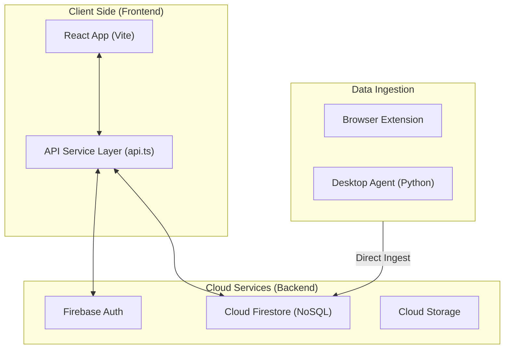

# Devise Dashboard — Backend Architecture Overview

The Devise Dashboard has transitioned from a traditional Python/FastAPI backend to a **100% Serverless Architecture** powered by **Firebase**. This document explains the infrastructure, data flow, and security model of the current codebase.

---

## 🏗️ High-Level Architecture

The system is now a **State-at-the-Edge** application. Instead of a middleman server (Python) managing database sessions and processing logic, the React frontend and local agents interact directly with Firebase.

---

## 🔐 Core Components

### 1. Authentication (Firebase Auth)
Identity management is handled entirely by Firebase. 
- **User Record**: Stores basic user info (email, name, UID).
- **Identity Tokens**: Firebase creates JWT-based ID tokens that are automatically attached to any Firestore request made via the Client SDK.

### 2. Database (Cloud Firestore)
Firestore is our NoSQL document database. Data is organized into hierarchical collections:

| Collection | Description |
| :--- | :--- |
| `profiles` | Maps `user_uid` to `org_id` and role. |
| `organizations` | Stores organization-level metadata (name, slug). |
| `detection_events` | The core "firehose" of AI tool usage detected by agents. |
| `heartbeats` | Real-time "I'm alive" signals from active devices. |
| `org_settings` | Configuration (budget, alert thresholds) for each org. |
| `subscriptions` | Tracked AI tool licenses and costs. |
| `tamper_alerts` | Security logs for agent integrity checks. |

### 3. Security (Firestore Rules)
Since there is no backend server to act as a gatekeeper, we enforce security via **Firestore Security Rules**. These rules live in the Firebase console and are evaluated for every request.

- **Isolation**: Users can *only* read data where the `org_id` matches the `org_id` in their authenticated `profile` document.
- **Write Limits**: Agents can write to `detection_events`, but regular users cannot modify other organizations' events.

---

## 📡 Data Flow: How Ingestion Works

Per the **Direct Firestore SDK Plan**, agents no longer POST to a FastAPI server. Instead:

1.  **Direct Write**: The agent (Browser or Desktop) uses a Firebase Service Account key or custom auth token to write directly into the `organizations/{org_id}/events` path.
2.  **Real-Time**: Because Firestore is reactive, the Dashboard's "Live Feed" can listen for changes and update the UI instantly without the user needing to refresh.

---

## 🧠 Business Logic (The "Server" in the Frontend)

Heavy lifting that usually happens on a server (e.g., calculating total spend, counting unique tools) is now moved to the **API Service Layer** (`frontend/src/services/api.ts`).

- **Aggregation**: When you load the Dashboard, the `fetchStats` function retrieves the raw documents for your org and calculates the totals (KPIs, risk counts) on the user's browser.
- **Analytics**: Charts and graphs are populated by processing the document snapshots retrieved from Firestore queries.

---

## 🚀 Benefits of This Model
- **Zero Maintenance**: No server process (`uvicorn`) to keep running or scale.
- **Instant Scaling**: Firebase handles 1 user or 1,000,000 users automatically.
- **Cost**: 100% Free on the Spark plan for development and small-scale usage.
- **Latency**: No network hop between a Python API and the DB; it's a direct connection.
